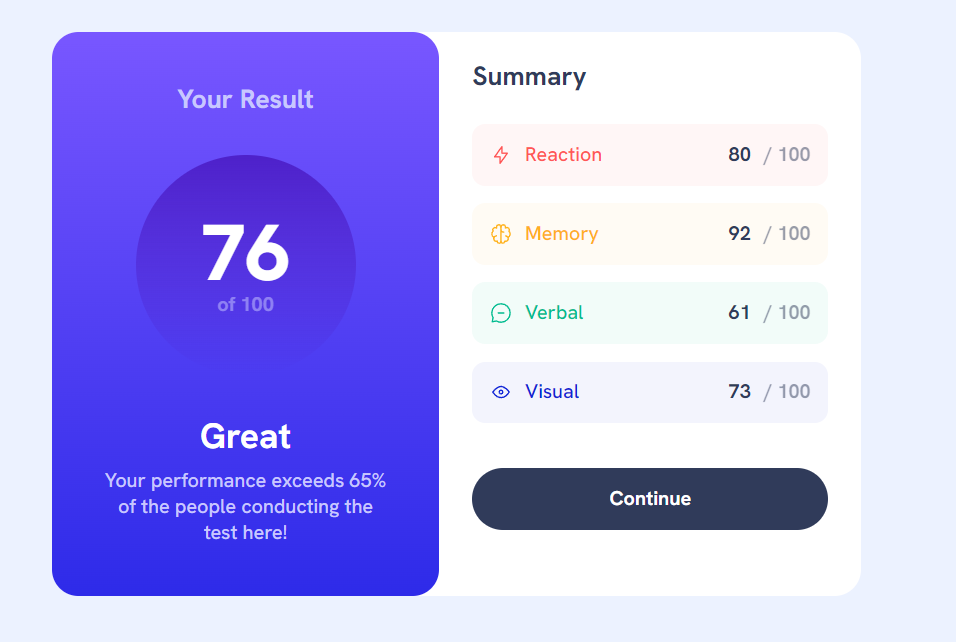

# Frontend Mentor - Results summary component

[Results summary component challenge on Frontend Mentor](https://www.frontendmentor.io/challenges/results-summary-component-CE_K6s0maV)

## Overview

### The challenge

Users should be able to:

- View the optimal layout depending on their device's screen size
- See hover and focus states for interactive elements

### Screenshot

## Process

### Built with

- Semantic HTML5 markup
- Tailwind CSS

### Useful resources

- [Tailwind CSS](https://tailwindcss.com/)
